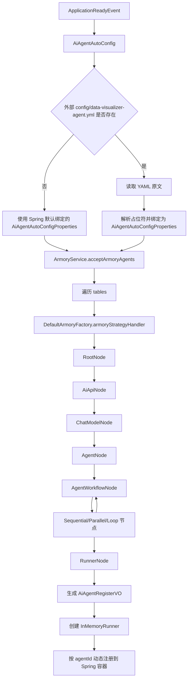
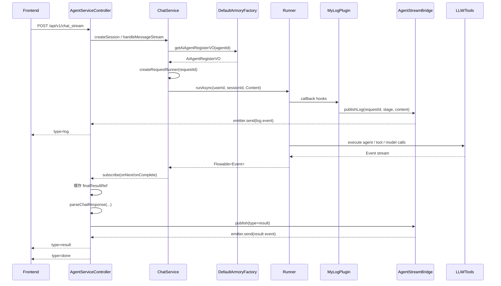
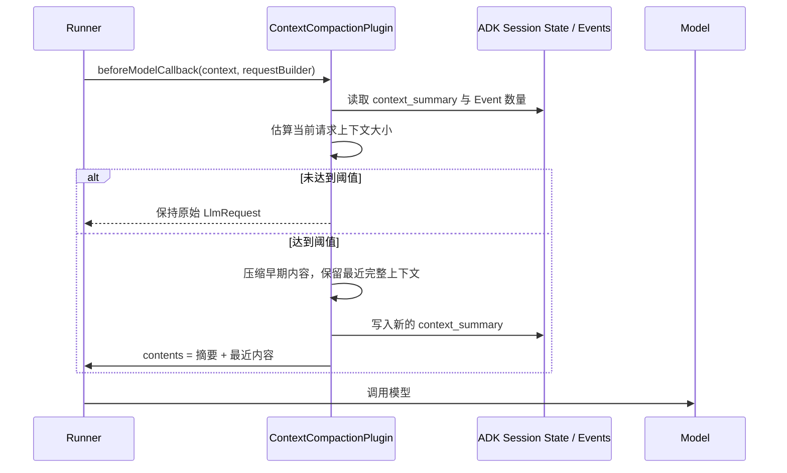

## 项目整体架构

### 模块划分

- `data-visualizer-app`
  启动模块，负责 Spring Boot 启动、Bean 组装、配置加载，以及 Agent 自动装配入口。
- `data-visualizer-trigger`
  接口触发层，负责暴露 HTTP API，例如创建 Session、同步对话、流式对话、查询配置等。
- `data-visualizer-domain`
  领域核心层，负责 Agent 装配、会话管理、对话编排、流式桥接、插件挂载等核心业务逻辑。
- `data-visualizer-infrastructure`
  基础设施层，负责 Netty Socket 通信、远程命令执行支撑等与外部环境交互的能力。
- `data-visualizer-api`
  接口定义层，主要放服务接口、请求 DTO、响应 DTO，作为模块间契约。
- `data-visualizer-types`
  通用类型层，放枚举、异常、基础类型定义，供多个模块复用。

````mermaid
flowchart LR
    A["Frontend / Client"] --> B["trigger<br/>HTTP 接口层"]
    B --> C["domain<br/>Agent 领域核心"]
    C --> D["infrastructure<br/>Socket / 外部能力"]
    C --> E["api / types<br/>接口契约与通用类型"]
    F["app<br/>启动与配置装配"] --> B
    F --> C
    F --> D
````

## Agent 动态装配

**如何通过 YAML 配置构建成一套可编排、可热更新的 Agent 运行时对象**。

YAML 配置的信息：

- 用哪个模型服务
- 挂哪些工具能力
- 定义哪些子 Agent
- 子 Agent 之间是串行、并行还是循环
- 最终由哪个 Runner 作为入口对外服务

### 启动装配链路总览



这张图里最重要的不是“顺序”，而是两个设计点：

1. 配置被先转换成统一的 `AiAgentAutoConfigProperties`。
2. 后续所有构建动作都通过一棵装配树逐步完成


### 启动入口：`AiAgentAutoConfig`

核心逻辑可以概括成下面这样：

```java
@Override
public void onApplicationEvent(ApplicationReadyEvent event) {
    try {
        String rawYaml = readCurrentRawYaml();

        if (rawYaml == null) {
            armoryService.acceptArmoryAgents(aiAgentAutoConfigProperties);
        } else {
            AiAgentAutoConfigProperties currentConfig = parseYaml(rawYaml);
            armoryService.acceptArmoryAgents(currentConfig);
        }
    } catch (Exception e) {
        log.log(Level.SEVERE, "Ai Agent 自动装配失败", e);
    }
}
```

- 默认情况下，走 Spring Boot 正常的 `@ConfigurationProperties` 绑定。
- 如果本地 `config/data-visualizer-agent.yml` 存在，则优先使用外部配置。
- 外部配置再通过 `Environment.resolvePlaceholders(...)` 解析占位符，比如 `${open-ai.key}`。

### 装配服务：`ArmoryService` 

拿到 `AiAgentAutoConfigProperties` 之后，先交给 `ArmoryService`。

```java
@Override
public void acceptArmoryAgents(AiAgentAutoConfigProperties aiAgentAutoConfigProperties) throws Exception {
    currentAiAgentAutoConfigProperties = aiAgentAutoConfigProperties;
    for (AiAgentConfigTableVO table : currentAiAgentAutoConfigProperties.getTables().values()) {
        StrategyHandler<ArmoryCommandEntity, DefaultArmoryFactory.DynamicContext, AiAgentRegisterVO> handler =
                defaultArmoryFactory.armoryStrategyHandler();
        handler.apply(
                ArmoryCommandEntity.builder()
                        .aiAgentConfigTableVO(table)
                        .build(),
                new DefaultArmoryFactory.DynamicContext());
    }
}
```

`ArmoryService` 只负责两件事：

1. 保存当前生效配置，便于后续查询或动态更新。
2. 遍历 `tables`，把每个 Agent 配置表交给装配工厂去处理。

### 装配树

主干路径是这样的：

```
RootNode
  -> AiApiNode
  -> ChatModelNode
  -> AgentNode
  -> AgentWorkflowNode
  -> Sequential / Parallel / Loop
  -> AgentWorkflowNode
  -> RunnerNode
```

#### 1. `RootNode`：启动路由

`RootNode` 把请求推进到下一个节点。

#### 2. `AiApiNode`：与底层模型建立连接

```
OpenAiApi openAiApi = OpenAiApi.builder()
        .baseUrl(aiApiConfig.getBaseUrl())
        .apiKey(aiApiConfig.getApiKey())
        .completionsPath(...)
        .embeddingsPath(...)
        .build();

dynamicContext.setOpenAiApi(openAiApi);
```

这一层解决的是“连到哪里去”的问题。它构建的是底层 API 客户端，而不是业务 Agent。

#### 3. `ChatModelNode`：挂载MCP、Skills

把两类能力挂进去：

- MCP 工具回调
- Skills 工具回调

```
ChatModel chatModel = OpenAiChatModel.builder()
        .openAiApi(openAiApi)
        .defaultOptions(OpenAiChatOptions.builder()
                .model(chatModelConfig.getModel())
                .toolCallbacks(toolCallbackList)
                .build())
        .build();
```

也就是说，到这一步为止，agent 可以调用工具

#### 4. `AgentNode`：封装成 LLM Agent

```
LlmAgent llmAgent = LlmAgent.builder()
        .name(agentConfig.getName())
        .description(agentConfig.getDescription())
        .model(new MySpringAI(chatModel))
        .instruction(agentConfig.getInstruction())
        .outputKey(agentConfig.getOutputKey())
        .build();
```

- 一个配置表里可以声明多个基础 Agent。
- 每个 Agent 都有独立的 `instruction` 和 `outputKey`。

系统支持**多个角色化 Agent 的组合式运行**。比如当前项目中的：

- `agent_analyst`
- `agent_drawer`
- `agent_reviewer`

它们本质上是同一个底层模型能力的不同人格封装。

#### 5. `AgentWorkflowNode`：构建工作流 Agent

`AgentWorkflowNode` 会读取配置里的 `agent-workflows`，根据 `type` 决定走哪条分支：

- `sequential` -> `SequentialAgentNode`
- `parallel` -> `ParallelAgentNode`
- `loop` -> `LoopAgentNode`

以串行节点为例：

```java
SequentialAgent sequentialAgent = SequentialAgent.builder()
        .name(currentAgentWorkflow.getName())
        .description(currentAgentWorkflow.getDescription())
        .subAgents(subAgents)
        .build();
dynamicContext.getAgentGroup().put(currentAgentWorkflow.getName(), sequentialAgent);
```

- 基础 Agent 是叶子节点
- Workflow Agent 是组合节点
- 最终形成一棵可执行的 Agent 树


------

###  `DynamicContext`：传递中间信息

负责在各节点之间传递状态：

- `openAiApi`
- `chatModel`
- `agentGroup`
- `currentStepIndex`
- `currentAgentWorkflow`
- `dataObjects`

它还有两个非常关键的方法：

```java
public <T> void setValue(String key, T value) {
    dataObjects.put(key, value);
}

public List<BaseAgent> queryAgentList(List<String> agentNames) {
    ...
}
```

### `RunnerNode` 构建运行对象

1. 根据 `runner.agent-name` 找到入口 Agent。
2. 根据 `plugin-name-list` 从 Spring 容器取出插件实例。
3. 创建 `InMemoryRunner`，并注册成 Spring Bean。

核心代码如下：

```java
BaseAgent baseAgent = dynamicContext.getAgentGroup().get(agentName);

List<BasePlugin> plugins = new ArrayList<>();
for (String pluginName : pluginNameList) {
    BasePlugin plugin = getBean(pluginName);
    plugins.add(plugin);
}

InMemoryRunner runner = new InMemoryRunner(baseAgent, appName, plugins);
aiAgentRegisterVO.setRunner(runner);
registerBean(agentId, AiAgentRegisterVO.class, aiAgentRegisterVO);
```

**对外暴露是 `AiAgentRegisterVO`**。

这意味着系统注册到 Spring 容器中是一份完整的运行时描述：

- `agentId`
- `agentName`
- `agentDesc`
- `baseAgent`
- `plugins`
- `runner`

这样一来，后续业务层拿到的就不仅是执行能力，还能拿到元信息、插件列表和运行器本身。这对管理端、调试链路、动态更新都很友好。

------

### 动态注册 Bean

`AbstractArmorySupport` 里有一个非常关键的方法：

```java
protected synchronized <T> void registerBean(String beanName, Class<T> beanClass, T beanInstance) {
    DefaultListableBeanFactory beanFactory =
            (DefaultListableBeanFactory) applicationContext.getAutowireCapableBeanFactory();

    BeanDefinitionBuilder beanDefinitionBuilder =
            BeanDefinitionBuilder.genericBeanDefinition(beanClass, () -> beanInstance);

    if (beanFactory.containsBeanDefinition(beanName)) {
        beanFactory.removeBeanDefinition(beanName);
    }

    beanFactory.registerBeanDefinition(beanName, beanDefinitionBuilder.getRawBeanDefinition());
}
```

**按 `agentId` 作为 Bean 名称注册**。

- Agent 不需要在代码里提前写死 `@Bean`
- 新增一个 Agent，不一定要改 Java 代码
- 替换配置后，可以删除旧定义再注册新定义
- 业务侧可以通过 `agentId` 动态获取对应 Agent

------

### 用了哪些模式，为什么这样设计

这一段很适合在掘金文章里升一层总结。

**责任链 / 策略路由模式**
装配过程被拆成多个 Node，每个 Node 只处理一种职责，再决定路由到哪个下一个节点。这样可以避免“一个方法管所有事情”的灾难。

**组合模式**
基础 `LlmAgent` 是叶子节点，`SequentialAgent`、`ParallelAgent`、`LoopAgent` 是组合节点。最终形成一棵可递归执行的 Agent 结构。

**工厂模式**
`DefaultArmoryFactory` 不直接制造所有对象细节，而是返回装配处理器入口，真正把“装配逻辑组织起来”。

**上下文对象模式**
`DynamicContext` 负责跨节点共享构建期状态，降低节点之间的耦合。

**运行时注册模式**
通过 `DefaultListableBeanFactory` 动态注册 Bean，让配置变更能真正作用到运行时对象，而不是停留在内存变量层面。

为什么选择这套设计，而不是简单写死？

今天可能只有绘图 Agent，明天可能增加：

- 报表分析 Agent
- 数据采集 Agent
- 工具编排 Agent
- 审批流程 Agent

## 一次对话请求如何流转

一条用户消息进来之后，系统如何把它送进 Agent Runtime，如何在执行过程中持续暴露日志，最后又如何把结构化结果返回给前端

这条链路决定了用户体验，也决定了系统是否真正具备“可观测、可调试、可交互”的工程价值。

经过了五层转换：

1. HTTP 请求被转成标准对话命令
2. 根据 `agentId` 找到已经装配好的 `Runner`，然后创建一个新的 Runner
3. 将用户消息包装成 ADK 能识别的 `Content`
4. 运行期间把日志、工具调用、模型过程异步推送出来
5. 任务完成后，再把最终结果解析成 `user` 或 `drawio` 返回前端

先看整体运行时链路。



- **主执行通道**：用户消息进入 Runner，产生真正的 Agent 执行结果
- **观测通道**：插件把执行过程中的日志通过桥接层异步发给前端

### 入口层：Controller 负责协议转换

运行时的第一站是 `AgentServiceController`。它同时提供了两类能力：

- `chat`：同步对话，直接等最终结果
- `chat_stream`：流式对话，边执行边输出日志，最后再返回最终结果

这两个接口背后调用的其实是同一套 Agent Runtime，只是对响应方式做了不同封装。

同步接口比较直接：

```java
@RequestMapping(value = "chat", method = RequestMethod.POST)
@Override
public Response<ChatResponseDTO> chat(@RequestBody ChatRequestDTO requestDTO) {
    String sessionId = requestDTO.getSessionId();
    if (sessionId == null || sessionId.isEmpty()) {
        sessionId = chatService.createSession(requestDTO.getAgentId(), requestDTO.getUserId());
    }

    List<String> messages = chatService.handleMessage(
            requestDTO.getAgentId(),
            requestDTO.getUserId(),
            sessionId,
            requestDTO.getMessage()
    );

    String result = messages.stream().reduce((first, second) -> second).orElse("");
    ChatResponseDTO responseDTO = parseChatResponse(result, String.join("\n", messages));
    return Response.<ChatResponseDTO>builder().data(responseDTO).build();
}
```

这里的设计思路是：**同步接口只关心“最终可用结果”**。
中间事件全部收集起来，最后取最末一条有效输出，再转成统一的 `ChatResponseDTO`。


------

### 为什么流式接口不能只把模型输出直接写回前端

一条完整的 Agent 流程，其中包含：

- 多个子 Agent 串行或循环执行
- 模型请求与响应
- MCP 工具调用
- 工具错误与异常信息
- 最终结果的结构化解析

如果只是把底层模型 token 原样转发，前端会遇到三个问题：

1. 看不到 Agent 内部过程，只能看到碎片文本
2. 无法区分“日志消息”和“最终结果”
3. 无法稳定提取 `drawio XML` 这种结构化输出


**把流式消息分成 `log / result / error / done` 四种类型。**

对应的数据结构是 `AgentStreamResponseDTO`：

```java
public class AgentStreamResponseDTO implements Serializable {
    private String type;      // log/result/error/done
    private String stage;     // run/agent/model/tool/system
    private String sessionId;
    private String requestId;
    private String content;
    private Long timestamp;
}
```

这意味着前端收到的不再是“模型吐出来的一串文本”，而是一种可消费的运行时事件流。

这一步非常关键，因为它把 AI 请求从“文本 IO”提升成了“事件协议”。

------

### 会话是怎么建立的

```java
@Override
public String createSession(String agentId, String userId) {
    AiAgentRegisterVO aiAgentRegisterVO = defaultArmoryFactory.getAiAgentRegisterVO(agentId);
    String appName = aiAgentRegisterVO.getAppName();
    InMemoryRunner runner = aiAgentRegisterVO.getRunner();
    String cacheKey = buildSessionCacheKey(agentId, userId);

    return userSessions.computeIfAbsent(cacheKey, key -> {
        Session session = runner.sessionService().createSession(appName, userId).blockingGet();
        return session.id();
    });
}
```

这里有两个值得注意的点。

**Session 来自 Runner 自己的 `sessionService()`。**
这意味着会话上下文不是业务层自己维护的，而是与底层 Agent Runtime 保持一致。后续模型记忆、上下文续接、事件关联，都是基于这个 Session 生效。

------

### 真正把请求送进 Agent Runtime 的，是 `ChatService`

一旦拿到 `agentId` 和 `sessionId`，运行时入口就从 Controller 切到 `ChatService`。

同步链路的关键代码是：

```
Content userMsg = Content.fromParts(Part.fromText(message));
Flowable<Event> events = runner.runAsync(userId, sessionId, userMsg);

List<String> outputs = new ArrayList<>();
events.blockingForEach(event -> outputs.add(event.stringifyContent()));
```

这段代码背后的意思非常重要：

- 用户输入先被包装成 ADK 的 `Content`
- 真正执行的 API 是 `runner.runAsync(...)`
- 返回值不是一个最终字符串，而是 `Flowable<Event>`

这说明在 ADK 视角里，一次对话不是“返回一个 answer”，而是“产生一串事件”。

这些事件里可能包含：

- 用户消息被接收
- 某个 Agent 开始执行
- 某个模型被调用
- 某个工具被触发
- 某一轮结果已经产生

也就是说，**事件流才是一次 Agent 执行的第一手真相**，最终文本只是事件流里最后被整理出来的一种表示。

------

### 为什么流式场景要“重新创建一个请求级 Runner”

这一段是整个运行时设计里最值得分析的地方之一。

在流式接口里，`ChatService` 没有直接复用注册表里的 `runner`，而是会构建一个“请求级 Runner”：

```java
@Override
public Flowable<Event> handleMessageStream(String agentId, String userId, String sessionId, String requestId, String message) {
    AiAgentRegisterVO aiAgentRegisterVO = defaultArmoryFactory.getAiAgentRegisterVO(agentId);
    Runner runner = createRequestRunner(aiAgentRegisterVO, requestId);

    Content userMsg = Content.fromParts(Part.fromText(message));
    return runner.runAsync(userId, sessionId, userMsg);
}
```

核心在 `createRequestRunner(...)`：

```java
private Runner createRequestRunner(AiAgentRegisterVO registerVO, String requestId) {
    Runner baseRunner = registerVO.getRunner();
    List<BasePlugin> plugins = new ArrayList<>(registerVO.getPlugins());

    for (int i = 0; i < plugins.size(); i++) {
        BasePlugin basePlugin = plugins.get(i);
        if (basePlugin.getName().equals("MyLogPlugin")) {
            plugins.set(i, new MyLogPlugin(requestId, agentStreamBridge));
        }
    }

    return Runner.builder()
            .agent(baseRunner.agent())
            .appName(baseRunner.appName())
            .artifactService(baseRunner.artifactService())
            .sessionService(baseRunner.sessionService())
            .memoryService(baseRunner.memoryService())
            .plugins(plugins)
            .build();
}
```

**运行时共享 Agent 定义和基础服务，但隔离请求级插件上下文。**

为什么不能直接把原来的 `MyLogPlugin` 挂在全局 Runner 上？

因为日志插件里有明显的请求态信息：

- `requestId`
- 当前请求对应的 `AgentStreamBridge`

如果多个请求共享同一个插件实例，就会出现典型并发问题：

- A 请求的日志串到 B 请求页面上
- `requestId` 被后一个请求覆盖
- 同时执行时，前端拿到错乱的流式日志

所以这里的做法是：

- **复用原 Runner 的 agent、sessionService、memoryService**
- **只替换插件列表中的日志插件实例**

这样做的好处非常明确：

- 会话和记忆服务保持一致
- 每次请求都能获得独立的日志上下文
- 避免修改全局注册对象，降低并发污染风险

这其实是一种很典型的“共享不可变核心 + 隔离可变请求态”的设计。

------

### MyLogPlugin 插件回调

**把原本只会写到后端日志里的执行信息，转成前端可消费的事件流。**

```java
@Override
public Maybe<Content> beforeRunCallback(InvocationContext invocationContext) {
    emitLog("run", "开始执行本次智能体任务");
    emitLog("run", "🏃 调用开始");
    emitLog("run", "   Invocation ID: " + invocationContext.invocationId());
    emitLog("run", "   Starting Agent: " + invocationContext.agent().name());
    return super.beforeRunCallback(invocationContext);
}
```

在模型调用前后：

```java
@Override
public Maybe<LlmResponse> beforeModelCallback(CallbackContext callbackContext, LlmRequest.Builder llmRequest) {
    emitLog("model", "开始请求大模型");
    emitLog("model", "🧠 LLM REQUEST");
    return super.beforeModelCallback(callbackContext, llmRequest);
}
```

在工具执行前后：

```java
@Override
public Maybe<Map<String, Object>> beforeToolCallback(BaseTool tool, Map<String, Object> toolArgs, ToolContext toolContext) {
    emitLog("tool", "开始调用工具：" + tool.name());
    return super.beforeToolCallback(tool, toolArgs, toolContext);
}
```

------

### `AgentStreamBridge`：把插件和 HTTP 隔开

日志插件虽然能拿到执行过程，但它并不适合直接操作 `ResponseBodyEmitter`。原因很简单：

- 插件属于运行时层
- `ResponseBodyEmitter` 属于 Web 层
- 如果二者直接耦合，插件就会绑死在 Spring MVC 上

所以项目中间加了一层桥：`AgentStreamBridge`。

```java
@Service
public class AgentStreamBridge {

    private final ConcurrentMap<String, StreamEmitterContext> requestEmitters = new ConcurrentHashMap<>();

    public void register(String sessionId, String requestId, ResponseBodyEmitter emitter) {
        requestEmitters.put(requestId, new StreamEmitterContext(sessionId, emitter));
    }

    public void publishLog(String requestId, String stage, String content) {
        publish(AgentStreamResponseDTO.log(null, requestId, stage, content));
    }

    public void publishDone(String sessionId, String requestId, String content) {
        publish(AgentStreamResponseDTO.done(sessionId, requestId, content));
    }
}
```

它的本质不是“工具类”，而是一个**运行时事件桥接器**。

它解决了三个具体问题。

**第一，按 `requestId` 做消息路由。**
每个请求注册一个 emitter，后续日志插件只管发 `requestId`，桥接器负责找到正确连接。

**第二，串行发送，避免并发写 emitter。**
内部用 `sendLock` 和 `completed` 做保护，避免同一个请求的多个回调并发写流，导致响应错乱。

**第三，给插件层提供稳定抽象。**
插件只需要知道“我可以 `publishLog`”，不需要知道底层到底是 SSE、`ResponseBodyEmitter`，还是以后换成 WebSocket。

这就是桥接层存在的真正意义：**解耦协议与运行时。**

------

### 最终结果先缓存，完成后再发

最终结果不会在每个事件到来时就立刻发给前端，而是先放到 `finalResultRef` 里，等主任务真正完成后再统一解析和发送。

```java
AtomicReference<String> finalResultRef = new AtomicReference<>("");

Disposable streamDisposable = chatService.handleMessageStream(...)
        .subscribe(
                event -> {
                    String content = event.stringifyContent();
                    if (StringUtils.isNotBlank(content)) {
                        finalResultRef.set(content);
                    }
                },
                throwable -> { ... },
                () -> {
                    ChatResponseDTO responseDTO = parseChatResponse(finalResultRef.get(), finalResultRef.get());
                    AgentStreamResponseDTO agentStreamResponseDTO = AgentStreamResponseDTO.builder()
                            .type("result")
                            .stage(StringUtils.defaultIfBlank(responseDTO.getType(), "user"))
                            .sessionId(currentSessionId)
                            .requestId(currentRequestId)
                            .content(responseDTO.getContent())
                            .timestamp(System.currentTimeMillis())
                            .build();

                    agentStreamBridge.publish(agentStreamResponseDTO);
                    agentStreamBridge.publishDone(currentSessionId, currentRequestId, "completed");
                    emitter.complete();
                }
        );
```

## 为什么要设计流式桥接层

做到这里，这个项目里一个很有代表性的设计点就出来了：
既然后端最终是通过 `ResponseBodyEmitter` 把流式消息发给前端，为什么不让 `MyLogPlugin` 直接持有 `ResponseBodyEmitter`，然后在回调里 `emitter.send(...)` 呢？

乍一看，这样更直接，代码也更少。
但如果真的这么做，系统很快就会在并发、分层、生命周期和可演进性上出问题。

所以项目里专门加了一层 `AgentStreamBridge`，把“插件产生日志事件”和“HTTP 长连接向前端发消息”这两件事隔开。这个设计看起来多了一层，实际上是把后面很多坑提前填掉了。

先看一个“看起来很顺手”的思路：

1. `Controller` 创建 `ResponseBodyEmitter`
2. 把它一路传到 `ChatService`
3. 再传到 `MyLogPlugin`
4. 插件在 `beforeRunCallback`、`beforeToolCallback` 之类的方法里直接 `emitter.send(...)`

伪代码大概会像这样：

```java
public class MyLogPlugin extends LoggingPlugin {

    private final ResponseBodyEmitter emitter;

    public MyLogPlugin(ResponseBodyEmitter emitter) {
        this.emitter = emitter;
    }

    @Override
    public Maybe<Content> beforeRunCallback(InvocationContext invocationContext) {
        emitter.send("开始执行任务");
        return super.beforeRunCallback(invocationContext);
    }
}
```

这段代码的问题，不在于“能不能跑”，而在于**它只能在最理想、最单纯的场景下跑**。一旦系统进入真实工程环境，就会暴露出一连串隐患。

**第一个问题：插件层不应该知道 HTTP 传输细节**

`MyLogPlugin` 的职责，本质上是运行时观测。
它关心的是：

- 当前进入了哪个回调阶段
- 模型是否开始调用
- 工具是否执行
- 是否发生异常
- 如何把这些信息输出为结构化事件

它本来不应该关心：

- 当前是不是 Spring MVC
- 是不是 `ResponseBodyEmitter`
- 响应是否超时
- emitter 是否已经 complete
- 发送失败要不要结束 HTTP 连接

一旦插件直接持有 `ResponseBodyEmitter`，它就从一个“运行时插件”退化成了“和 Web 层耦合的特殊组件”。

比如以后如果你想把这套流式能力换成：

- SSE 标准封装
- WebSocket
- Netty 长连接
- 消息队列转推
- 后台任务事件记录

那插件就要跟着改。
这说明当前设计没有把“事件产生”和“事件传输”分开。

而 `AgentStreamBridge` 的意义就在这里：
插件只需要知道“我有一条日志事件要发布”，至于这条事件最终如何送到前端，由桥接层负责。

**第二个问题：一个插件实例不可能安全地服务多个请求**

这是最典型的并发问题。

从装配阶段可以看到，默认注册到系统里的 `Runner` 和 `Plugin` 是全局对象。
如果你让全局 `MyLogPlugin` 直接持有一个 `ResponseBodyEmitter`，那它就一定会遇到这个问题：

- A 用户发起请求，插件里绑定了 A 的 emitter
- B 用户紧接着又发起请求，插件里的 emitter 被换成 B
- 这时 A 请求还没结束，执行中的日志会直接串到 B 的前端页面上

这不是小概率问题，而是并发环境下的必然问题。

所以项目里后来采用的是“请求级 Runner + 请求级日志插件”：

```java
private Runner createRequestRunner(AiAgentRegisterVO registerVO, String requestId) {
    Runner baseRunner = registerVO.getRunner();
    List<BasePlugin> plugins = new ArrayList<>(registerVO.getPlugins());

    for (int i = 0; i < plugins.size(); i++) {
        BasePlugin basePlugin = plugins.get(i);
        if (basePlugin.getName().equals("MyLogPlugin")) {
            plugins.set(i, new MyLogPlugin(requestId, agentStreamBridge));
        }
    }

    return Runner.builder()
            .agent(baseRunner.agent())
            .appName(baseRunner.appName())
            .artifactService(baseRunner.artifactService())
            .sessionService(baseRunner.sessionService())
            .memoryService(baseRunner.memoryService())
            .plugins(plugins)
            .build();
}
```

这里插件只知道自己的 `requestId`，并不知道 emitter 本身。
而 emitter 则被注册在 `AgentStreamBridge` 里，由桥接层按 `requestId` 做路由。

换句话说，真正隔离并发请求的，不只是“请求级插件实例”，更是“插件不直接持有连接对象”这件事。

**第三个问题：`ResponseBodyEmitter` 有明确的生命周期，而插件不适合管理它**

`ResponseBodyEmitter` 不是一个普通对象，它有很强的连接生命周期语义：

- 注册后开始可写
- 可能超时
- 可能客户端中断
- 可能发送中抛异常
- 可能已经 complete 后仍有后续回调进来

而插件回调的执行时机，往往比你想象的更复杂：

- `beforeRunCallback`
- `onEventCallback`
- `beforeModelCallback`
- `afterToolCallback`
- `afterRunCallback`

这些回调可能跨多个线程，也可能在响应已经结束后才继续触发部分尾部逻辑。

如果插件直接持有 emitter，它就必须自己处理：

- emitter 是否还活着
- 这个请求是否已经完成
- 是否需要串行发送
- 发送失败是否要吞掉异常
- 是否还需要清理状态

这会让插件里充满大量与业务无关的连接管理代码，最终污染整个插件实现。

而桥接层专门把这部分接过去了。

来看 `AgentStreamBridge` 的关键实现：

```java
private final ConcurrentMap<String, StreamEmitterContext> requestEmitters = new ConcurrentHashMap<>();

public void register(String sessionId, String requestId, ResponseBodyEmitter emitter) {
    requestEmitters.put(requestId, new StreamEmitterContext(sessionId, emitter));
}
```

再看发送逻辑：

```java
public void publish(AgentStreamResponseDTO responseDTO) {
    StreamEmitterContext context = requestEmitters.get(responseDTO.getRequestId());
    if (context == null || context.completed.get()) {
        return;
    }

    synchronized (context.sendLock) {
        if (context.completed.get()) {
            return;
        }

        try {
            context.emitter.send(JSON.toJSONString(fillSessionIdIfNecessary(context.sessionId, responseDTO)));
        } catch (Exception e) {
            context.completed.set(true);
            throw new RuntimeException(e);
        }
    }
}
```

这里桥接层统一承担了三件事：

- 查找连接
- 控制并发发送
- 感知连接是否已结束

于是插件就能保持干净，只做“产生日志事件”这件事。

**第四个问题：日志消息和最终结果，本来就不是一个层次的东西**

这个项目的流式输出，不只是简单把字符串往前推，而是明确区分成了四类事件：

- `log`
- `result`
- `error`
- `done`

这一点在 `AgentStreamResponseDTO` 中定义得很清楚：

```
public class AgentStreamResponseDTO implements Serializable {
    private String type;
    private String stage;
    private String sessionId;
    private String requestId;
    private String content;
    private Long timestamp;
}
```

这意味着系统内部真正传递的，不是“文本”，而是“结构化运行时事件”。

一旦你让插件直接操作 emitter，插件就必须自己决定：

- 这条消息是 `log` 还是 `error`
- 要不要补 `sessionId`
- 要不要统一 JSON 格式
- 前端消费协议要不要一起跟着改

这其实是在让插件承担“事件协议编排”职责。
而这个职责显然更适合放在桥接层。

看 `AgentStreamBridge` 的接口就很清楚：

```
public void publishLog(String requestId, String stage, String content) {
    publish(AgentStreamResponseDTO.log(null, requestId, stage, content));
}

public void publishError(String requestId, String content) {
    publish(AgentStreamResponseDTO.error(null, requestId, content));
}

public void publishDone(String sessionId, String requestId, String content) {
    publish(AgentStreamResponseDTO.done(sessionId, requestId, content));
}
```

插件不需要拼接最终响应格式，只需要说：

- 我现在要发一条 `run` 阶段日志
- 我现在要发一条工具异常
- 其他都交给桥接层

这让“运行时事件定义”集中到了一个地方，后续协议升级会非常轻松。

------

### 当前桥接层有什么用

如果把 `AgentStreamBridge` 抽象一下，它实际上提供了五个很核心的能力。

#### 1. 请求级消息路由

桥接层内部用 `requestId -> StreamEmitterContext` 的映射做事件分发：

```
private final ConcurrentMap<String, StreamEmitterContext> requestEmitters = new ConcurrentHashMap<>();
```

这意味着插件只要带上 `requestId`，桥接层就能把消息投递到正确的前端连接。
对于多用户并发、多窗口、多书签对话，这一点是必须的。

#### 2. 生命周期隔离

桥接层知道 emitter 什么时候注册、什么时候 complete、什么时候 clear：

```
public void clear(String requestId) {
    StreamEmitterContext context = requestEmitters.remove(requestId);
    if (context != null) {
        context.completed.set(true);
    }
}
```

这让清理逻辑不需要散落在插件里，也不用让插件关心 HTTP 生命周期。

#### 3. 并发发送保护

同一个请求在运行期间，可能会非常密集地产生日志：

- `beforeAgent`
- `beforeModel`
- `afterModel`
- `beforeTool`
- `afterTool`

如果这些回调落在不同线程，直接写 emitter 会非常危险。
桥接层通过 `sendLock` 做串行化发送，确保消息顺序和连接稳定性。

#### 4. 协议统一

不管是日志、错误还是最终结果，桥接层都会统一输出成前端可识别的 JSON 字符串，而不是让每个插件自己拼格式。

#### 5. 可替换传输实现

今天桥接层内部封装的是 `ResponseBodyEmitter`。
明天如果要切换到 WebSocket，其实只要替换桥接层内部实现，而插件层几乎不用动。

这就是分层带来的真正收益：
**变化被限制在边界内，而不是在系统里四处扩散。**

如果没有桥接层，哪些 bug 会更难排查

如果插件直接写 emitter，出现以下问题时会非常难定位：

- 前端 A 页面收到 B 请求的日志
- 连接已经关闭，但插件还在继续 `send`
- 某次工具回调写流失败，导致整个 Agent 执行异常中断
- 不同回调线程同时写 emitter，前端收到乱序 JSON
- 某次结果事件和日志事件格式不一致，前端解析失败

这些 bug 的共同特点是：
**表象发生在前端，根因却藏在运行时回调和连接生命周期的交叉区域。**

而一旦加入桥接层，定位思路就会清晰很多：

- 插件负责“有没有发事件”
- 桥接层负责“事件有没有送到正确连接”
- Controller 负责“连接有没有正常结束”

这就是典型的“按边界拆故障域”。
在复杂系统里，这种设计的价值远大于少写几行代码。

------

### 设计思想

如果从模式角度总结，`AgentStreamBridge` 至少融合了三种思想。

**桥接思想（Bridge）**
把“运行时事件”和“HTTP 输出机制”解耦。插件不直接依赖具体传输手段。

**中介者思想（Mediator）**
插件、Controller、Emitter 三者之间不直接互相操作，而是通过桥接层协调。

**注册表思想（Registry）**
桥接层内部维护 `requestId -> emitter context` 的注册表，实现请求级路由。

这三个思想放在一起，就把原本一团很容易缠住的运行时逻辑，拆成了可管理的几个层次。

### 后续优化

当然，这种设计不是没有代价。

当前方案增加了一层桥接对象，也带来一些额外状态管理：

- 需要 `register`
- 需要 `clear`
- 需要维护 `requestId`
- 需要处理发送失败后的清理

**第一，统一流式接口的会话复用策略。**
当前 `chat_stream` 更偏向后端重建 Session，后面可以收敛成“优先使用前端传入的 sessionId，缺失时再创建”。

**第二，把 `ResponseBodyEmitter` 升级为更标准的 SSE 输出协议。**
这样前端事件消费会更规范，也更利于代理层和网关配置。

**第三，让桥接层支持可插拔输出通道。**
比如同一份运行时事件，既可以推给前端，也可以落日志系统或持久化到数据库。

**第四，把 `requestId` 和 `sessionId` 关联的上下文抽成独立对象。**
未来如果要做执行轨迹回放、任务审计，这层上下文会非常有用。

## 插件机制与日志隔离

同样是一个 `MyLogPlugin`，为什么不能直接注册成全局单例一直复用？为什么流式请求里一定要临时创建一个“请求级日志插件”？

- 插件如何参与一次 Agent 执行
- 多个并发请求如何避免日志串线和上下文污染

这也是这个项目后端从“能跑”走向“能稳定跑”的关键一步。

------

### 插件的启动

从启动装配阶段可以看到，Runner 在创建时会从配置里读取插件列表：

```
runner:
  agent-name: sequential_draw_process
  plugin-name-list:
    - contextCompactionPlugin
    - myLogPlugin
```

在 `RunnerNode` 里，这些插件会被注入到 `InMemoryRunner`：

```java
List<BasePlugin> plugins;
List<String> pluginNameList = runnerConfig.getPluginNameList();
if (null != pluginNameList && !pluginNameList.isEmpty()) {
    plugins = new ArrayList<>();
    for (String pluginName : pluginNameList) {
        BasePlugin plugin = getBean(pluginName);
        plugins.add(plugin);
    }
} else {
    plugins = ImmutableList.of();
}

return new InMemoryRunner(baseAgent, appName, plugins);
```

这说明插件不是“外围辅助工具”，而是 **Runner 执行生命周期的一部分**。
一次请求送进 Runner 之后，插件会在多个关键节点获得回调，比如：

- 用户消息进入时
- 整个运行开始前后
- 某个 Agent 开始和结束时
- 模型调用前后
- 工具调用前后
- 异常发生时

插件运行时横切能力的挂载点。
如果你想给 Agent Runtime 加入：

- 执行日志
- 安全审计
- Token 统计
- 指标埋点
- 调用追踪
- 权限校验

插件机制就是最天然的扩展位置。

------

### `ContextCompactionPlugin`：只压缩模型输入，不裁剪会话历史

多轮对话有一个很容易被忽略的问题：`InMemorySessionService` 会持续保留同一个 Session 的 Event 历史。会话越长，下一次模型调用携带的上下文越大，输入 Token 成本、延迟和超过模型上下文窗口的风险都会一起上涨。

这里不能简单地删除旧 Event。Event 历史不仅是对话记录，还可能包含工具调用、工具结果和 Agent 工作流执行痕迹；直接裁剪会破坏会话的原始事实，也会让排障和后续能力扩展失去依据。

项目把这个问题放在插件层解决：`ContextCompactionPlugin` 在 ADK 的 `beforeModelCallback` 中，只改写本次即将发送给模型的 `LlmRequest.Builder.contents(...)`。`Session.events` 不删除、不重排，摘要则通过 `callbackContext.state()` 保存为当前 Session 的 `context_summary`。



核心代码比在 `ChatService` 里手工拼 Prompt 更贴近 ADK 的执行边界：

```java
@Override
public Maybe<LlmResponse> beforeModelCallback(
        CallbackContext callbackContext,
        LlmRequest.Builder llmRequest) {
    try {
        LlmRequest request = llmRequest.build();
        Object previousSummary = callbackContext.state().get("context_summary");
        String existingSummary = previousSummary instanceof String ? (String) previousSummary : null;

        CompactionResult result = ContextCompactionSupport.compact(
                request.contents(), existingSummary, callbackContext.events().size());

        if (result.isCompacted()) {
            callbackContext.state().put("context_summary", result.getSummary());
            llmRequest.contents(result.getContents());
        }
    } catch (RuntimeException e) {
        log.warn("模型上下文压缩失败，将使用原始上下文", e);
    }
    return Maybe.empty();
}
```

这里有四个关键约束。

1. **这是请求侧软压缩。** 修改的是本次模型请求，不是 Session 存储；应用重启后，原始历史和 `context_summary` 都随内存 Session 一起消失。
2. **摘要是累积的。** 已有 `context_summary` 会作为下一次摘要的开头，再追加新进入压缩区的早期内容，避免只保留最近一次被截出的片段。
3. **阈值有多重兜底。** 当前实现以约 `12,000` Token、`40,000` 字符或 `30` 个 Event 为触发条件；Token 采用“字符数除以四”的保守估算，因此字符数和 Event 数量仍是有效兜底。
4. **保留窗口不能制造孤儿工具结果。** 默认保留最后 8 条 `Content`；如果窗口第一条是工具响应，会向前移动边界，把相应的工具调用一并保留。

当前没有为摘要再发起一次模型调用。`ContextCompactionSupport` 将早期 `Content` 规范化为带角色、工具调用和工具结果标记的结构化文本，并限制单条和总摘要长度。这样做让压缩结果可预测，也避免“摘要请求再次触发上下文压缩插件”的递归调用链。

当压缩失败、摘要为空或历史未达到阈值时，插件不会中断主对话：它保留原始 `LlmRequest` 继续调用模型。这是把上下文压缩定位为性能与容量优化，而不是可用性的前置条件。

------

### `MyLogPlugin` 把生命周期变成可观测事件

当前项目中的 `MyLogPlugin` 继承自 `LoggingPlugin`，但做的事情已经不只是“打印日志”，而是把 ADK 的执行生命周期翻译成统一的流式事件。

例如在收到用户消息时：

```
@Override
public Maybe<Content> onUserMessageCallback(InvocationContext invocationContext, Content userMessage) {
    emitLog("run", "收到用户消息");
    emitLog("run", "🚀 USER MESSAGE RECEIVED");
    emitLog("run", "   Invocation ID: " + invocationContext.invocationId());
    emitLog("run", "   Session ID: " + invocationContext.session().id());
    emitLog("run", "   User ID: " + invocationContext.userId());
    emitLog("run", "   App Name: " + invocationContext.appName());
    emitLog("run", "   Root Agent: " + invocationContext.agent().name());
    emitLog("run", "   User Content: " + formatContent(Optional.ofNullable(userMessage)));
    return super.onUserMessageCallback(invocationContext, userMessage);
}
```

在模型调用前：

```
@Override
public Maybe<LlmResponse> beforeModelCallback(CallbackContext callbackContext, LlmRequest.Builder llmRequest) {
    LlmRequest request = llmRequest.build();
    emitLog("model", "开始请求大模型");
    emitLog("model", "🧠 LLM REQUEST");
    emitLog("model", "   Model: " + request.model().orElse("default"));
    emitLog("model", "   Agent: " + callbackContext.agentName());
    return super.beforeModelCallback(callbackContext, llmRequest);
}
```

在工具执行完成后：

```
@Override
public Maybe<Map<String, Object>> afterToolCallback(BaseTool tool, Map<String, Object> toolArgs, ToolContext toolContext, Map<String, Object> result) {
    emitLog("tool", "工具调用完成：" + tool.name());
    emitLog("tool", "🛠 TOOL COMPLETED");
    emitLog("tool", "   Tool Name: " + tool.name());
    emitLog("tool", "   Agent: " + toolContext.agentName());
    emitLog("tool", "   Result: " + formatArgs(result));
    return super.afterToolCallback(tool, toolArgs, toolContext, result);
}
```

这些回调共同把原本藏在 ADK Runtime 内部的执行细节，抽成了前端可理解的阶段事件：

- `run`
- `agent`
- `model`
- `tool`

这很重要，因为 Agent 的复杂度本来就高于普通模型调用。
如果没有这层插件，前端只能看到“正在生成中”，完全不知道：

- 现在卡在哪一层
- 模型是否已发出请求
- 工具是不是执行超时
- 是哪个子 Agent 在工作
- 最终失败是模型问题还是工具问题

所以从职责上讲，`MyLogPlugin` 实际上是 **运行时观测适配器**。

------

### 为什么全局单例插件在并发下会出问题

问题的根源在于：
日志插件不是一个纯函数对象，它带有明显的“请求态”。

当前 `MyLogPlugin` 有两个关键字段：

```
private final String requestId;
private final AgentStreamBridge agentStreamBridge;
```

其中 `requestId` 决定了这条日志属于哪个前端请求。
这意味着插件输出的每一条事件，都不是“系统级广播”，而是“必须路由给某一个具体请求”。

如果插件是全局单例，会出现一个非常典型的并发冲突场景：

1. 请求 A 进入，插件拿到 `requestId=A`
2. 请求 B 进入，插件又被覆盖成 `requestId=B`
3. 请求 A 的模型回调和工具回调仍在继续触发
4. A 的日志被发到了 B 的流里

前端看到的表现就是：

- 自己的窗口里突然出现别人的执行日志
- 日志顺序混乱
- `requestId` 和 `sessionId` 对不上
- 最后结果页显示正常，但过程完全错位

这类问题最麻烦的地方在于高并发下的时序污染**。
你平时本地单测可能完全看不出来，一上线多用户使用就会出现。

所以这里必须明确一个原则：

> **带请求态的插件，绝不能作为共享单例跨请求复用。**

------

### 请求级 Runner 的真正意义，不只是“换个插件”

为了解决上面的问题，当前实现没有直接修改全局注册的 Runner，而是为每次流式请求构造了一个请求级 Runner。

核心代码在 `ChatService.createRequestRunner(...)`：

```java
private Runner createRequestRunner(AiAgentRegisterVO registerVO, String requestId) {
    Runner baseRunner = registerVO.getRunner();
    List<BasePlugin> sourcePlugins = registerVO.getPlugins();
    List<BasePlugin> plugins = sourcePlugins == null ? new ArrayList<>() : new ArrayList<>(sourcePlugins);
    boolean replacedLogPlugin = false;

    for (int i = 0; i < plugins.size(); i++) {
        BasePlugin basePlugin = plugins.get(i);
        if (basePlugin.getName().equals("MyLogPlugin")) {
            plugins.set(i, new MyLogPlugin(requestId, agentStreamBridge));
            replacedLogPlugin = true;
        }
        if (basePlugin.getName().equals("ContextCompactionPlugin")) {
            plugins.set(i, new ContextCompactionPlugin(requestId, agentStreamBridge));
        }
    }

    if (!replacedLogPlugin) {
        plugins.add(new MyLogPlugin(requestId, agentStreamBridge));
    }

    return Runner.builder()
            .agent(baseRunner.agent())
            .appName(baseRunner.appName())
            .artifactService(baseRunner.artifactService())
            .sessionService(baseRunner.sessionService())
            .memoryService(baseRunner.memoryService())
            .plugins(plugins)
            .build();
}
```

- 复用原有的 `agent`
- 复用原有的 `appName`
- 复用原有的 `artifactService`
- 复用原有的 `sessionService`
- 复用原有的 `memoryService`
- **替换带 `requestId` 的日志插件和上下文压缩插件**

换句话说，它不是重建整个运行时，而是在原有运行时外壳上，为当前请求注入安全的观测和上下文控制能力。上下文压缩的摘要不保存在插件字段中，而是从 `CallbackContext.state()` 读取和写入；因此同步与流式路径看到的是同一个 Session State。

这背后反映的是一个很成熟的工程原则：

> **共享稳定内核，隔离易变上下文。**

Agent 定义、Session 服务、Memory 服务这些都是稳定基础设施，可以共享。
而 `requestId` 这种强请求态信息，必须隔离。

------

### 为什么这里不能直接改 `registerVO` 里的插件列表

代码里有一条很重要的注释：

```
// 不能直接改 registerVO 里的插件列表，否则并发请求会共享同一个上下文插件实例。
```

这条注释其实正好点出了这个设计的核心风险。

如果你图省事，直接这样写：

```
registerVO.getPlugins().set(i, new MyLogPlugin(requestId, agentStreamBridge));
```

看起来似乎也能让当前请求拿到一个新插件，但它实际是在修改全局注册对象里的插件引用。
这样后果会非常严重：

- 当前请求替换掉了全局插件
- 后续新请求会读到这个已经带旧 `requestId` 的插件
- 多个线程可能同时改同一个插件列表
- 同一 Agent 的运行时配置会被请求级操作污染

本质上，这就把“请求期临时状态”写回了“全局装配态对象”。

所以当前实现先拷贝一份列表：

```
List<BasePlugin> plugins = sourcePlugins == null ? new ArrayList<>() : new ArrayList<>(sourcePlugins);
```

这是一个很小但很关键的动作。
它确保了请求级改动只活在当前执行链路里，不会反向污染系统注册表。

这类设计细节特别适合写进博客，因为它体现的是典型的工程判断力，而不是单纯语法技巧。

------

### 日志隔离解决了哪几类问题

把 `MyLogPlugin` 做成请求级实例，并不是只解决“日志串线”这么一个问题。它实际上一起解决了下面几类风险。

1. 请求日志归属问题

每条日志都能稳定绑定到一个 `requestId`，桥接层据此路由到正确前端连接。

2. 回调并发污染问题

不同请求的回调虽然可能同时发生，但每个请求用的是自己的插件实例，不共享可变上下文。

3. 生命周期错位问题

某个请求结束后，对应插件实例也自然失效。不会存在“老请求的插件继续给新请求发日志”的情况。

4. 可观测数据独立问题

如果后续要为每次请求增加：

- 请求耗时统计
- token 用量统计
- 工具调用次数
- 子 Agent 执行轨迹

这些都可以安全挂在请求级插件实例上，而不会彼此污染。

#### 5. 调试与问题回放问题

当线上出现问题时，可以根据 `requestId` 去回放整条日志链路，而不是在一堆全局交错日志里手工拆分。

这就是为什么在 AI Agent 系统里，“请求级上下文隔离”比普通 Web 项目更重要。
因为它的执行链更长、阶段更多、异步更多，污染一旦发生，排查成本会非常高。

------

### 用了什么模式

这一段如果从设计模式角度提炼，会更有文章深度。

**装饰/增强思想**
请求级 `MyLogPlugin` 并没有改变 Agent 业务逻辑，只是在运行时外围增加一层日志增强能力。

**原型/克隆思想**
虽然没有显式实现 `clone()`，但通过拷贝插件列表并替换局部元素，本质上是在做一种轻量级请求上下文克隆。

**上下文隔离思想**
全局 Runner 持有稳定上下文，请求级插件持有临时上下文，两者边界清晰。

**不可变核心 + 可变边缘**
Agent、SessionService、MemoryService 这些核心对象尽量保持稳定，而与请求绑定的插件、日志流属于可变边缘。

这种组合非常适合 Agent Runtime 这种“静态装配 + 动态执行”并存的系统。

------

### 优点和代价

任何隔离设计都不是免费的，请求级日志插件也一样。

#### 优点

- 并发安全性高，不会把请求上下文写串
- 运行时观测能力清晰，日志和请求一一对应
- 不污染全局 Runner 和注册表
- 后续扩展埋点、审计、追踪能力时非常自然
- 更容易排查线上问题

#### 代价

- 每次流式请求都要创建一个新的 Runner 包装对象
- 需要维护 `requestId`
- 插件列表需要复制一份
- 逻辑上比“全局单例插件”复杂一层

但这个代价是值得的。
因为这里新增的复杂度，并不是业务功能复杂度，而是**并发正确性复杂度**。
这类复杂度如果不在设计阶段正面解决，后面一定会以线上 bug 的形式回来。

------

### 继续优化

当前方案已经足够实用，但如果继续往平台化方向走，我觉得有几个优化点很值得做。

现在 `createRequestRunner(...)` 里是手工判断：

```
if (basePlugin.getName().equals("MyLogPlugin")) {
    plugins.set(i, new MyLogPlugin(requestId, agentStreamBridge));
}
```

后续如果还有其他带请求态的插件，比如：

- TracePlugin
- MetricsPlugin
- AuditPlugin

就会越来越多 `if/else`。
更好的做法是定义一个“请求级插件工厂”接口，根据插件类型动态创建请求实例。

当前日志插件只拿了 `requestId` 和 `agentStreamBridge`。
后面其实可以抽成一个 `AgentRequestContext`，里面统一放：

- requestId
- sessionId
- agentId
- userId
- streamBridge
- startTime

这样插件不需要零散拿参数，扩展性会更好。

现在请求级插件主要服务于流式接口。
如果后面希望同步接口也有统一追踪能力，其实也可以走同样的请求级 Runner 机制，只是输出目标不一定是前端流，而可能是日志系统或审计系统。

现在事件主要是即时流向前端。
如果要做任务回放、执行审计、失败诊断，后续可以在桥接层之外再加一条持久化链，把关键阶段事件记录下来。

