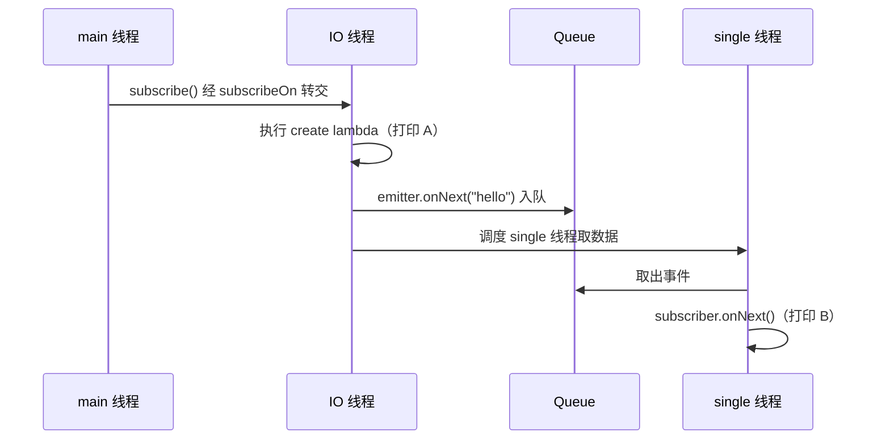

> 在学agent时突然对`Flowable<Event>`感兴趣 
> 它的底层实现是什么？`subscribeOn()` 换了线程之后，`subscribe()` 里的回调到底在哪个线程执行？线程之间又是怎么传递数据的？


`Flowable<Event>` 属于 Reactive Streams 这一类抽象

| 语言          | 对应抽象                                 | 生态                |
| ------------- | ---------------------------------------- | ------------------- |
| Java          | `Flowable<Event>`                        | RxJava              |
| Kotlin        | `Flow<Event>`                            | Kotlin Coroutines   |
| C#            | `IAsyncEnumerable<Event>`                | async/await         |
| TypeScript/JS | `Observable<Event>`                      | RxJS                |
| Python        | `AsyncIterator[Event>` / async generator | asyncio             |
| Rust          | `Stream<Item = Event>`                   | futures / Tokio     |
| Go            | `<-chan Event`                           | channel + goroutine |
| Swift         | `AsyncStream<Event>`                     | Swift Concurrency   |

```text
异步数据源 + 持续事件 + 流式处理 + 订阅 + 背压 + 操作符组合
```

于是产生一个问题：RxJava 的 `Flowable` 底层到底是怎么实现的？

**线程池 + 队列 + CAS/原子变量 + 回调 + 状态机。**

下面按"回调 → 操作符链 → 背压 → 线程调度"的分析。

## 最底层是回调：`onNext()` 就是普通方法调用

Reactive Streams 的 `Subscriber` 接口大致是这样：

```java
public interface Subscriber<T> {
    void onSubscribe(Subscription s);
    void onNext(T t);
    void onError(Throwable t);
    void onComplete();
}
```

所以生产者执行：

```java
subscriber.onNext(event);
```

含义就是字面上的：**调用订阅者的 `onNext()` 方法，把一个事件交给它处理**。没有任何特殊语法，也不涉及网络或消息中间件。

数据的生命周期被设计成一串方法调用：

```text
Producer
   ├── onNext(Event1)
   ├── onNext(Event2)
   ├── onNext(Event3)
   └── onComplete()
```

> **如果没有显式的线程切换，整条调用链就在当前线程同步执行。**

看这段代码：

```java
Flowable.create(emitter -> {
    System.out.println("A: " + Thread.currentThread().getName());
    emitter.onNext("hello");
}, BackpressureStrategy.BUFFER)
.subscribeOn(Schedulers.io())
.subscribe(x -> {
    System.out.println("B: " + Thread.currentThread().getName());
});
```

输出通常是：

```text
A: RxCachedThreadScheduler-1
B: RxCachedThreadScheduler-1
```

`A` 在 IO 线程执行没问题——这是 `subscribeOn(Schedulers.io())` 的效果。但为什么 `B` 也在 IO 线程？

因为 `emitter.onNext("hello")` 本质上就是在当前线程调用下游的 `subscriber.onNext("hello")`，而 `subscribe(x -> ...)` 里的 lambda 就是下游的 `onNext()`。调用链从 `A` 到 `B` 一路都是同步方法调用，中间没有任何人说过"切线程"。

一个不含 RxJava 的类比：

```java
void producer(Consumer<String> consumer) {
    System.out.println("A");
    consumer.accept("hello");   // 当前线程直接调用
}

producer(x -> System.out.println("B"));
// A 和 B 在同一个线程执行，这是方法调用的默认行为
```

RxJava 没有改变这个默认行为。

## 操作符：不断包装 Subscriber

那 `map()`、`filter()` 这些操作符在干嘛？

```java
flowable
    .filter(event -> event.getId() > 100)
    .map(Event::getData)
    .subscribe(...);
```

RxJava 并不是把数据收集起来再批量处理，而是在订阅时构建一条 **Subscriber 包装链**：

```text
Producer
   │ onNext(Event)
   ▼
FilterSubscriber        // 不满足条件 → 丢弃；满足 → 调用下游
   │ onNext(Data)
   ▼
MapSubscriber           // event.getData() 后调用下游
   │ onNext(Data)
   ▼
最终 Subscriber
```

`MapSubscriber` 的 `onNext()` 大致就是：

```java
public void onNext(Event event) {
    downstream.onNext(event.getData());
}
```

所以 RxJava 的核心思想之一可以概括为：

> **通过不断包装 Subscriber 构建事件处理链，事件沿着 `onNext()` 调用链逐级传播。**

这也是为什么 `emitter.onNext(event)` 和 `subscriber.onNext(event)` 看起来是两回事、实际是一回事：前者是生产者侧的入口，事件进入 Flowable 内部后，会经过若干层 Operator 的包装，最终到达你写的 `subscribe()` 回调——整个过程就是一条方法调用链。

## Subscription：数据通道之外的控制通道

订阅建立时会形成一个三元关系：

```text
Publisher
    │ subscribe()
    ▼
Subscriber
    │ onSubscribe(s)
    ▼
Subscription
```

`Subscription` 的接口只有两个方法：

```java
public interface Subscription {
    void request(long n);
    void cancel();
}
```

它解决的是另一个方向的问题——**消费者对生产者的控制**：

```text
        数据方向
Producer ───────────────→ Consumer
             onNext(event)

        控制方向
Producer ←────────────── Consumer
             request(n)
             cancel()
```

- `request(n)`：消费者告诉生产者"我最多允许你再发 n 个"。这就是**背压（Backpressure）**的基础。如果生产速度远大于消费速度，没有需求量控制，缓存的事件可能把内存撑爆。
- `cancel()`：取消订阅关系。比如用户点击"停止生成"，就可以调用 `cancel()` 让上游停止产出。

背压用水流理解很直观：水流（生产速度）快于水龙头放出速度（消费速度），管道就会积压；`request(n)` 就是消费者回头喊一嗓子"慢点，我只能处理这么多"。

这也是 `Flowable` 和 `Observable` 的关键区别：`Flowable` 支持背压，`Observable` 不支持。

## 线程模型：subscribeOn 与 observeOn 到底改变了什么

现在回到线程问题。把三种情况摆在一起看。

**情况 1：什么都不加**

```java
Flowable.create(...).subscribe(...);
```

调用 `subscribe()` 的线程执行订阅，上游 lambda 在这个线程执行，`onNext()` 链也在这个线程执行。全程单线程同步。

**情况 2：只有 `subscribeOn`**

```java
Flowable.create(...)
    .subscribeOn(Schedulers.io())
    .subscribe(...);
```

`subscribeOn(Schedulers.io())` 的意思是：**把订阅动作以及上游的工作安排到 IO Scheduler 提供的线程上**。于是：

```text
main 线程
   │ subscribe()
   ▼
把上游任务提交给 IO Scheduler
   ▼
IO 线程
   ├── 生产事件（A）
   └── onNext() 链一路同步执行（B）
```

A、B 都在 IO 线程——不是 `subscribeOn` "控制"了下游，而是**没有人切线程，下游自然跟着 `onNext()` 的调用线程走**。

注意一个容易搞错的点：`Flowable.create(...)` 在订阅之前只是在构建流对象，lambda 里的代码要等 `subscribe()` 发生后才会执行。所以不存在"lambda 在调用 `Flowable.create()` 的线程执行"这回事——它由订阅发生时的调度决定。

**情况 3：`subscribeOn` + `observeOn`**

```java
Flowable.create(emitter -> {
    System.out.println("A: " + Thread.currentThread().getName());
    emitter.onNext("hello");
}, BackpressureStrategy.BUFFER)
.subscribeOn(Schedulers.io())
.observeOn(Schedulers.single())
.subscribe(x -> {
    System.out.println("B: " + Thread.currentThread().getName());
});
```

输出：

```text
A: RxCachedThreadScheduler-1
B: RxSingleScheduler-1
```

这才是真正出现 `Producer Thread ≠ Consumer Thread` 的时刻：



`observeOn()` 做的事情可以概括为：

> **在它所在的位置插一个"队列 + 线程切换"的节点：上游的 `onNext()` 把事件放进队列，`observeOn` 指定的 Scheduler 提供线程从队列取出事件，再调用下游。**

没有这个节点，`onNext()` 就只是普通方法调用，不会自己换线程。

两者的分工一句话记：

```text
subscribeOn()  →  上游（订阅 + 生产）从哪个线程开始执行
observeOn()    →  从这里开始，下游信号在哪个线程处理
都没有          →  当前线程一路同步执行
```


## 不同线程之间到底怎么传递数据

`observeOn` 出现之后，才会真正碰到"线程 A 生产的对象，线程 B 怎么拿到"这个问题。

答案不是"线程 A 把对象发送给线程 B"。同一个 JVM 里的线程**共享内存**，任何能被两个线程访问到的对象，它们都能看到。真正要解决的是两个问题：

1. **交接点**：数据放在哪里？——通常是一个并发队列。
2. **并发安全**：两个线程同时读写这个队列，怎么保证不坏？——CAS、volatile、锁、并发队列等机制保证写入对另一个线程可见且结构不被破坏。

抛开 RxJava，用最原始的生产者-消费者模型手写一遍：

```java
BlockingQueue<Event> queue = new LinkedBlockingQueue<>();

// 生产线程
new Thread(() -> queue.offer(new Event())).start();

// 消费线程
new Thread(() -> {
    Event event = queue.take();   // 阻塞直到有数据
    System.out.println(event);
}).start();
```

```text
Thread A (Producer)
   │ queue.offer(event)
   ▼
┌─────────────────┐
│  共享的并发队列   │  ← 两个线程都能访问的堆内存
└─────────────────┘
   │ queue.take()
   ▼
Thread B (Consumer)
```

`observeOn()` 底层就是这个模型加上需求量控制：上游往队列放，下游线程从队列取，`request(n)` 决定最多放多少。

所以"异步事件流"并不是什么特殊的数据传输技术，它的底层就是 **Java 多线程 + 共享内存 + 并发队列 + 线程调度**，RxJava 在这之上做了封装。

## 常见误区

**误区 1：`Flowable` 自动异步**

`Flowable` 本身不创建线程，也不保证异步。异步性来自 `Scheduler` 背后的线程池。不加任何调度器，一条流可以完全在单个线程里同步跑完。

**误区 2：`onNext()` 是"往队列里发消息"**

最简单的情况下（没有 `observeOn` 等会引入队列的操作符），`onNext()` 就是一个普通方法调用，事件从生产者到消费者之间甚至不需要队列。队列只在需要跨线程交接时才出现。

**误区 3：`subscribeOn()` 之后，`subscribe()` 的回调会回到发起订阅的线程（比如主线程）**

这是本文开头那段代码演示的核心误区。事实是：回调跟随 `onNext()` 的调用线程执行。上游在 IO 线程调 `onNext()`，回调就在 IO 线程执行；想让回调去别的线程，用 `observeOn()`。

**误区 4：把 `Flowable` 理解成"高级 Stream / 异步 Event 列表"**

它更准确的定位是：**一个支持异步生产、订阅、操作符组合和背压控制的 Publisher 抽象**。背压（`request(n)`）和取消（`cancel()`）是它区别于普通异步迭代的关键能力。

## 八、延伸：这个抽象正是 Agent 事件流的底座

这套模型在今天最常见的落点是 LLM Agent 的流式输出。

Agent 的执行天然是一个事件序列：思考、工具调用、工具结果、逐 token 的文本增量、结束。用传统的 `Request → Response` 表达很别扭，用 `Request → Event Stream` 则非常自然：

```text
AgentEvent
├── AgentStarted
├── ThinkingStarted
├── ToolCallStarted
├── ToolCallCompleted
├── LLMToken
├── LLMToken
└── AgentCompleted
```

于是整个 Agent 可以抽象成 `Flowable<AgentEvent>`（Java）、`AsyncIterator[AgentEvent]`（Python）、`Observable<AgentEvent>`（TypeScript），通过 SSE 或 WebSocket 推给前端；用户点击"停止生成"时，本质就是调用 `subscription.cancel()`。

有两点值得区分：

- **对外输出**采用事件流，是当前 Agent 系统的主流做法；
- **内部执行**不一定非得是响应式代码——Agent 内部完全可以是普通的同步调用（调 LLM、执行工具、再调 LLM），只是最后以事件流的形式对外输出。

所以如果自己设计 Agent 的核心接口，返回 `Stream<AgentEvent>` 比返回一个最终的 `AgentResult` 表达力强得多——前者能覆盖"输入 → 一连串事件 → 最终结果"的完整过程。

## 结论

把 `Flowable` 压缩成一个可以单独复习的模型：

| 组件                           | 职责                                                   |
| ------------------------------ | ------------------------------------------------------ |
| `Publisher` / `Flowable`       | 产生数据，持有事件流定义                               |
| `Subscriber`                   | 数据来了怎么处理（`onNext/onError/onComplete`）        |
| `Subscription`                 | 要多少（`request(n)`）、不要了（`cancel()`）——控制通道 |
| Operator（map/filter/flatMap） | 包装 Subscriber，形成同步调用链                        |
| `Scheduler` + 线程池           | 决定代码在哪个线程执行                                 |
| 并发队列                       | 线程之间交接数据的共享内存结构                         |

三条核心结论：

1. **`onNext()` 是普通方法调用**。没有 `observeOn()`，下游就在 `onNext()` 发出的线程同步执行。
2. **`subscribeOn` 管上游，`observeOn` 管下游**。`observeOn` 的实现就是"队列 + 线程切换"节点。
3. **跨线程传数据靠共享内存中的并发结构**（队列 + CAS/锁/内存可见性保证），不存在什么"线程间发消息"的魔法。