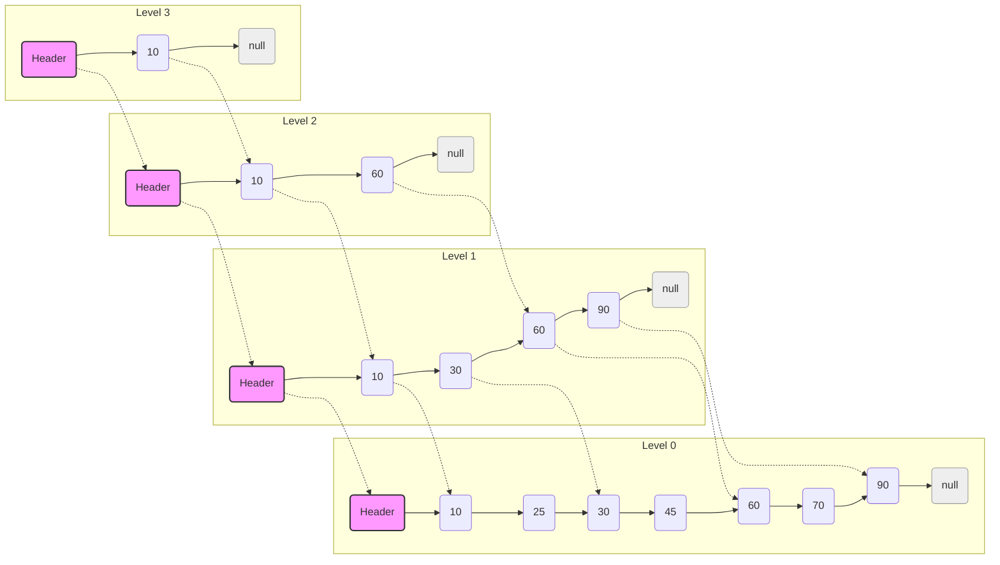

>https://github.com/tengta119/skip-list



## 通过 Java 深入理解跳表

在计算机科学的世界里，我们总是在寻找“最合适”的数据结构。我们不仅需要它能存储数据，更重要的是，能够高效地检索、添加和删除数据。尽管平衡二叉搜索树（如红黑树或 AVL 树）通常是保持数据有序并实现对数时间复杂度的首选方案，但它们的实现可能相当复杂，涉及到精巧的旋转和平衡逻辑。

这时，**跳表（Skip List）** 登场了。跳表是一种概率性数据结构，它能提供与平衡树相同的平均时间复杂度（查找、插入和删除均为 $O(\\log n)$），但实现起来通常要简单得多。它是一种巧妙而优雅的解决方案，利用概率为你的数据构建了一条高效的“快车道”。

今天，我们将一起对一个完整、可用于生产的 Java 跳表实现进行一次深度探索。我们将逐一分解它，以理解其背后的工作原理。

### 核心思想：为你的数据构建一个“高速列车”系统

想象一个标准的有序链表。要查找一个元素，你可能需要从头开始遍历很长一段路，检查每一个节点。这就像一趟每站都停的“慢车”——对于长途旅行来说效率极低。

跳表通过增加多个“层级”的链接来改进这一点。

  * **第 0 层 (Level 0):** 这是包含所有元素的底层基础链表（我们的“慢车”）。
  * **第 1 层及以上:** 这些是“快车道”。每个更高的层级都作为一条捷径，跳过了其下一层级的多个节点。

在查找元素时，你从最高层（最快的快车道）开始。你尽可能地向前遍历，但又不会超过你的目标。然后，你下降一个层级，重复这个过程。当你到达第 0 层时，你已经精准地到达了所需位置，并且跳过了绝大多数元素。

*(图片来源: Wikimedia Commons)*

其魔力在于这些层级是如何创建的。当一个新节点被插入时，我们使用一个随机过程（就像抛硬币）来决定它的高度。这种概率性方法确保了在平均情况下，跳表能够保持平衡和高效，而无需复杂的再平衡算法。

### 剖析 Java 实现

让我们深入研究一下提供的代码。该实现被封装在 `SkipList<K, V>` 类中，这是一个泛型类，可以处理任何可比较的键（`K`）和任何值（`V`）。

#### 构建基石：`Node` 类

一切都从 `Node` 开始。它不仅仅是一个键值对，更是我们多层结构的核心。

```java
public static class Node<K extends Comparable<K>, V> {
    K key;
    V value;
    // 该节点的高度
    int level;
    // 一个前向指针数组。forwards.get(i) 是在第 i 层的下一个节点。
    ArrayList<Node<K,V>> forwards;

    public Node(K key, V value, int level) {
        this.key = key;
        this.value = value;
        this.level = level;
        // 为该节点的所有层级初始化前向指针
        forwards = new ArrayList<>(Collections.nCopies(level + 1, null));
    }
    // ... getters 和 setters
}
```

这里的关键组件是 `forwards`。它是一个 `ArrayList`，其中每个索引 `i` 都存储了对第 `i` 层下一个节点的引用。一个 `level = 3` 的节点将同时存在于第 0、1、2 和 3 层。

#### `SkipList` 的核心属性

主类通过几个关键变量来组织整个结构。

```java
// 跳表可能的最大高度
public static final int MAX_LEVEL = 32;
// 一个特殊的头节点，作为所有层级的起点
private Node<K, V> header;
// 列表中的元素数量
private int nodeCount;
// 当前跳表中存在的最高层级
private int skipListLevel;
```

`header` 是一个“哨兵”节点，它简化了逻辑。它不持有任何实际数据，但作为查找和插入的通用入口点，避免了在列表开头进行空值检查。

#### 查找 (`searchNode`)

查找操作是理解“快车道”概念的最佳方式。其逻辑是一个清晰的自顶向下、先右后下的模式。

```java
public boolean searchNode(K key) {
    Node<K, V> current = this.header;
    // 1. 从跳表的最高层开始
    for (int i = this.skipListLevel; i >= 0; i--) {
        // 2. 在当前层级上前进，只要下一个节点的键值更小
        while (current.forwards.get(i) != null && current.forwards.get(i).getKey().compareTo(key) < 0) {
            current = current.forwards.get(i);
        }
        // 3. 下降到下一层 (通过 for 循环的 i-- 实现)
    }
    // 4. 循环结束后，current 是第 0 层上目标节点位置的前一个节点
    current = current.forwards.get(0);

    // 5. 检查是否找到了节点并且键匹配
    return current != null && current.getKey().compareTo(key) == 0;
}
```

#### 插入 (`insertNode`)

插入是最复杂的部分。它涉及两个主要阶段：

1.  在每个层级找到正确的插入位置。
2.  创建新节点，并将其“拼接”到其随机确定的各个层级的链表中。

<!-- end list -->

```java
public synchronized boolean insertNode(K key, V value) {
    Node<K, V> current = this.header;
    // update 数组用于存储新节点在每一层的前驱节点
    ArrayList<Node<K, V>> update = new ArrayList<>(Collections.nCopies(MAX_LEVEL + 1, null));

    // 阶段一：找到插入点
    for (int i = this.skipListLevel; i >= 0; i--) {
        while (current.forwards.get(i) != null && current.forwards.get(i).getKey().compareTo(key) < 0) {
            current = current.forwards.get(i);
        }
        update.set(i, current); // 存储前驱节点
    }

    current = current.forwards.get(0);
    if (current != null && current.getKey().compareTo(key) == 0) {
        current.setValue(value); // 键已存在，仅更新值
        return true;
    }

    // 阶段二：创建并拼接新节点
    int randomLevel = generateRandomLevel(); // 决定新节点的高度
    if (randomLevel > skipListLevel) {
        // 如果新节点比当前跳表更高，更新跳表的层级
        for (int i = skipListLevel + 1; i < randomLevel + 1; i++) {
            update.set(i, header);
        }
        skipListLevel = randomLevel;
    }

    Node<K, V> insertNode = createNode(key, value, randomLevel);
    // 通过重新连接指针来拼接节点
    for (int i = 0; i <= randomLevel; i++) {
        insertNode.forwards.set(i, update.get(i).forwards.get(i));
        update.get(i).forwards.set(i, insertNode);
    }
    nodeCount++;
    return true;
}
```

`update` 数组是这里的关键。它存储了每一层的“拐点”——即在需要下降之前你访问的最后一个节点。这些节点正是需要更新其 `forwards` 指针以指向我们新节点的节点。

节点的高度由 `generateRandomLevel()` 决定：

```java
private static int generateRandomLevel() {
    int level = 0;
    // 以 50% 的概率持续增加层级（就像抛硬币）
    while (new Random().nextInt(2) == 1) {
        level++;
    }
    return Math.min(MAX_LEVEL, level);
}
```

这个简单的概率方法就是让跳表在平均情况下保持平衡的原因。

#### 删除 (`deleteNode`)

删除遵循与插入类似的模式：首先，找到待删除节点的前驱节点，然后绕过它。

```java
public synchronized boolean deleteNode(K key) {
    ArrayList<Node<K, V>> delete = new ArrayList<>(Collections.nCopies(MAX_LEVEL + 1, null));
    Node<K, V> current = header;
    // 1. 找到目标节点的所有前驱节点
    for (int i = skipListLevel; i >= 0; i--) {
        while (current.forwards.get(i) != null && current.forwards.get(i).key.compareTo(key) < 0) {
            current = current.forwards.get(i);
        }
        delete.set(i, current);
    }
    current = current.forwards.get(0);

    // 2. 如果找到节点，则绕过它
    if (current != null && current.key.compareTo(key) == 0) {
        for (int i = 0; i < this.skipListLevel; i++) {
            // 如果这一层的前驱节点指向我们的目标，就更新它
            if (delete.get(i).forwards.get(i) != current) break;
            delete.get(i).forwards.set(i, current.forwards.get(i));
        }

        // 3. 清理工作：如果顶层变空，则降低跳表的层级
        while (this.skipListLevel > 0 && this.header.forwards.get(skipListLevel) == null) {
            skipListLevel--;
        }
        nodeCount--;
        return true;
    }
    return false;
}
```

### 一个实用的功能：通过 `dumpFile` 和 `loadFile` 实现持久化

这个实现的一个突出特点是它能够将数据结构持久化到文件中。这对于需要跨次运行维护状态的应用程序（如一个简单的数据库或缓存）至关重要。

  * **`dumpFile()`**: 该方法遍历最底层的链表（第 0 层），并将每个键值对以简单的 `key:value;` 格式写入文件。

    ```java
    public void dumpFile() {
        try (BufferedWriter bufferedWriter = new BufferedWriter(new FileWriter(STORE_FILE))) {
            Node<K, V> node = this.header.forwards.get(0);
            while (node != null) {
                String data = node.getKey() + ":" + node.getValue() + ";";
                bufferedWriter.write(data);
                bufferedWriter.newLine();
                node = node.forwards.get(0);
            }
        } catch (IOException e) {
            throw new RuntimeException("Failed to dump file", e);
        }
    }
    ```

  * **`loadFile()`**: 该方法逐行读取文件，解析键值对，并巧妙地重用 `insertNode` 方法来在内存中重建跳表。这是一个出色的设计选择，因为它确保了加载后的数据结构是有效且结构正确的。

    ```java
    public void loadFile() {
        try (BufferedReader bufferedReader = new BufferedReader(new FileReader(STORE_FILE))) {
            String data;
            while ((data = bufferedReader.readLine()) != null) {
                // 一个辅助函数用于解析 "key:value;" 字符串
                Node<K, V> node = getKeyValueFromString(data);
                if (node != null) {
                    insertNode(node.getKey(), node.getValue());
                }
            }
        } catch (Exception e) {
            throw new RuntimeException(e);
        }
    }
    ```

### 总结

跳表是算法设计中简洁性和概率力量的有力证明。它为其核心操作实现了令人垂涎的 $O(\\log n)$ 平均时间性能，可与复杂的平衡树相媲美，但其实现却更直接、更容易理解。

这段 Java 代码提供了一个极佳的、真实世界的例子，展示了如何从零开始构建一个跳表，并配备了泛型和数据持久化功能。它是每个开发者工具箱中一个强大的工具，也是算法优雅之美的一个完美例证。


## Q&A
### 1、什么是跳表，它是如何工作的？


跳表是一种概率性数据结构，基于多层链表，每一层都是下一层的一个子集。最底层是原始数据的完整列表，每个元素在上面一层出现的概率是 P（通常取 1/2）。

每层都有两个指针，一个指向同层的下一个元素，另一个指向下层的相同元素（如果存在）。查找、插入或删除操作的平均时间复杂度为 O(log n)。

### 2、跳表与平衡树相比有什么优势和劣势？
跳表的优势：

简单性：跳表的算法和数据结构比平衡树简单得多。对于许多开发者而言，理解和实现跳表比实现一个红黑树或 AVL 树要容易。
并发友好：跳表由于其分层和链表的本质，更容易实现锁的细粒度管理，使其更适合于并发操作。在多线程环境中，跳表可以较容易地通过锁分离技术实现高效的并发操作。
动态性：跳表可以很自然地扩展，添加更多层级以应对数据增长，而不需要复杂的重平衡操作。
跳表的劣势：

空间消耗：跳表使用多层指针，意味着每个元素都需要额外的空间来存储指向其他元素的引用。这比平衡树的空间开销要大。
平均性能：虽然跳表的平均操作时间复杂度为 O(log n)，但这是一种概率性表现，在某些极端情况下可能不如平衡树表现稳定。
随机性：跳表的效率依赖于随机化过程，用于确定元素应该出现在哪些层上。这种随机性使得性能具有一定的不可预测性。
平衡树的优势：

稳定性：平衡树如 AVL 树或红黑树保证了最坏情况下的时间复杂度为 O(log n)，这比跳表的概率性保证更稳定。
空间效率：平衡树通常每个节点只需存储几个额外指针（父节点、左右子节点），不需要像跳表那样存储多个层次的指针。
理论优化：平衡树在理论研究和优化方面更为成熟，众多变种如红黑树、B树等都被广泛用于文件系统和数据库。
平衡树的劣势：

实现复杂性：平衡树的算法和维护平衡的逻辑相对复杂，实现错误可能导致树结构损坏。
并发难度：在多线程环境中，维持树的平衡状态需要复杂的锁机制或其他并发控制技术，这可能导致性能下降。
### 3、跳表这一数据结构 有哪些实际应用？

1、数据库

索引构建：跳表可用于构建内存数据库和数据库索引，特别是那些需要快速插入和删除的场景，如LevelDB 和 RocksDB 使用跳表来维护内存中的数据结构，便于快速的键值查找和范围查询。

LSM 树：在基于日志结构合并树（LSM Tree）的存储引擎中，跳表用于处理写入操作，因为它支持高效的插入性能，并能快速构建新的索引。

2、 缓存系统

内存存储：在需要有序键值对的缓存系统中，跳表可以提供比纯哈希表更丰富的功能，例如Redis中的Sorted Sets就是通过跳表实现的，支持基于分数的数据排序和快速访问。

3、 网络路由

高效路由表：跳表由于其高效的搜索、插入和删除操作，可以用于网络路由表的构建，特别是在动态变化的网络环境中，跳表能快速更新路由信息。

4、 实时数据分析

排行榜和计分板：在需要实时更新和查询的系统中，例如在线游戏的排行榜，跳表可以快速插入新的得分并调整排名，同时也能快速响应排名查询。

5、 并发系统

多线程访问：由于跳表的设计允许更简单的并发实现，它们经常被用在需要多线程安全访问的应用中，尤其是在实现细粒度锁或锁自由结构时。

### 4、跳表如何支持快速插入、删除和搜索操作？

1、快速搜索

跳表通过多层的链表结构实现快速搜索。在跳表中，最底层包含所有元素，而上层是下层的子集，并作为快速通道使用，每一层都为有序链表。

搜索过程：

搜索从最顶层开始，比较当前节点的下一个节点的值与目标值。
如果目标值大于下一个节点的值，则向右移动。
如果目标值小于下一个节点的值，或者没有下一个节点，则向下移动到下一层继续搜索。
重复此过程，直至到达最底层。
在最底层，如果找到目标值，则搜索成功；如果没有找到，则搜索失败。
这种层级结构大大减少了搜索路径的长度，平均搜索时间复杂度为 O(logn)。

2、快速插入

跳表的插入操作不仅要在底层插入元素，还可能需要在上层中插入该元素的额外引用（通过随机算法决定）。

插入过程：

首先进行搜索操作，找到在底层应该插入元素的位置。
在底层插入元素。
使用抛硬币或伪随机数决定该元素是否参与上层。
如果决定插入上层，则在相应位置进行插入，并可能继续向上扩展。
重复此过程直到不再插入更高层为止。
这个过程确保了插入的时间复杂度平均也是 O(logn)。

3、 快速删除

删除操作类似于插入操作，需要在所有包含目标元素的层中删除该元素。

删除过程：

使用搜索操作找到目标元素的位置。
从最底层开始，逐层向上删除所有指向该元素的节点。
对于每一层，调整指针以绕过被删除的节点。
删除操作的时间复杂度同样为 O(logn)，因为删除操作涉及到的层数也是对数级别的。

### 5、redis中如何使用跳表这一数据结构

跳表在 Redis Sorted Set 中的使用

1、 功能实现

跳表在 Sorted Set 中实现了以下关键功能：

插入操作：当一个新元素添加到 Sorted Set 中时，它会被插入到跳表中，元素位置基于其分数。如果多个元素具有相同的分数，它们会基于字典序进行排序。
删除操作：可以从跳表中移除元素，无论它们的分数或位置。
搜索操作：可以快速找到具有特定分数的元素，或者根据分数范围（如范围查询）获取元素列表。
排名查找：可以快速确定元素在跳表中的排名，或者查找特定排名的元素。 效率
由于跳表的平均时间复杂度为 O(log N)，这使得即使是在非常大的数据集中，插入、删除和查找操作也非常快速。

这种效率是通过在多个层级上维护指向元素的指针来实现的，这样搜索时可以快速跳过大量元素。

2、 为什么选择跳表而不是红黑树

Redis 的作者 Antirez 选择跳表来实现 Sorted Set 的主要原因之一是跳表代码实现起来更简单，而且在并发环境下，跳表更易于进行锁分离（fine-grained locking）。

尽管从理论上讲，红黑树在最坏情况下提供了相同的时间复杂度保证，跳表的实现和维护却更为直观。

3、 应用场景示例

在实际应用中，例如，开发者可能会使用 Redis Sorted Set 来实现一个实时排行榜系统，用户的分数更新后，可以即时反映在排行榜中，而不需要重新排序整个数据集。

这对于需要高性能和实时性的应用来说非常重要。

### 6、为什么平衡树在并发方面不够友好

复杂的平衡操作：

平衡树通过旋转和重新平衡来维护树的平衡状态。在并发环境中，每次插入或删除操作后都需要执行这些操作，这增加了同步的难度。多个线程同时尝试进行这些修改可能会导致数据结构损坏，除非非常小心地控制这些操作的并发。

锁的需求和管理：

为了保证操作的正确性，平衡树在并发环境中通常需要细粒度的锁或者全局锁来防止多个线程同时修改同一个部分的树结构。这种锁机制可能导致：

死锁：多个线程尝试获取彼此持有的锁。
锁竞争：高并发下，多个线程竞争相同的锁，增加了等待时间，降低了系统的整体性能。
锁开销：管理锁和处理锁冲突会带来额外的时间和空间开销。
不一致性风险：

在高并发操作中，如果锁的使用不当，可能导致数据不一致性。例如，在执行树旋转或重新平衡的过程中，如果多个线程交叉读写同一个节点，可能会导致一部分线程看到的数据是不一致的。

范围查询复杂性：

平衡树常用于执行范围查询，如在数据库索引中查找所有符合特定条件的项。在并发环境下，保持这种操作的正确性而不引入重大性能损失是具有挑战性的，尤其是在需要锁定多个节点进行操作时。

设计和调试难度

平衡树的并发实现比单线程实现复杂得多，设计和调试也更加困难。这可能需要更深入的理解树结构操作和并发控制技术。

替代方案的可用性：

由于上述挑战，一些系统可能选择使用其他数据结构作为替代，例如跳表或锁自由（lock-free）数据结构，它们可以更简单地支持并发操作。


